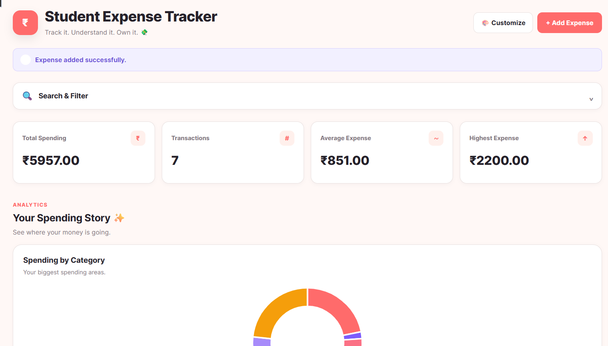
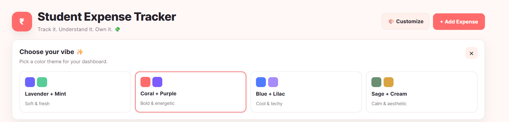
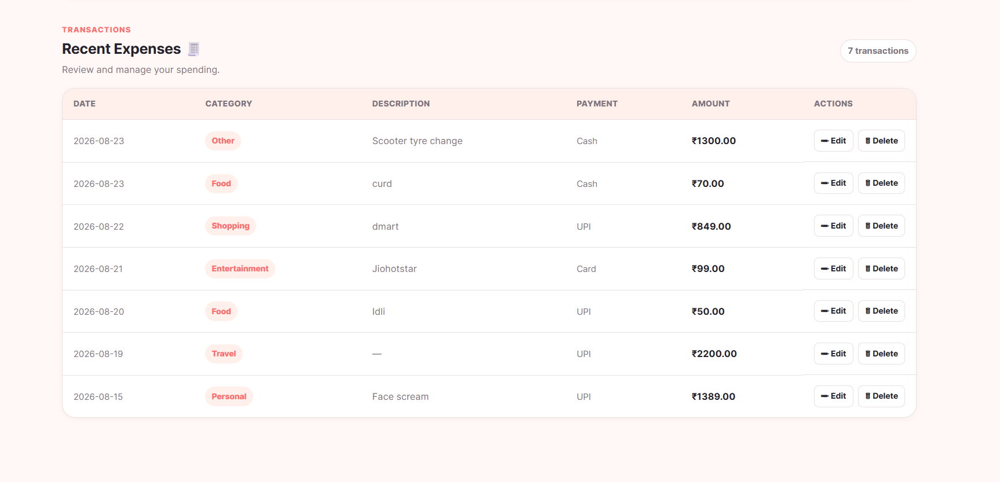
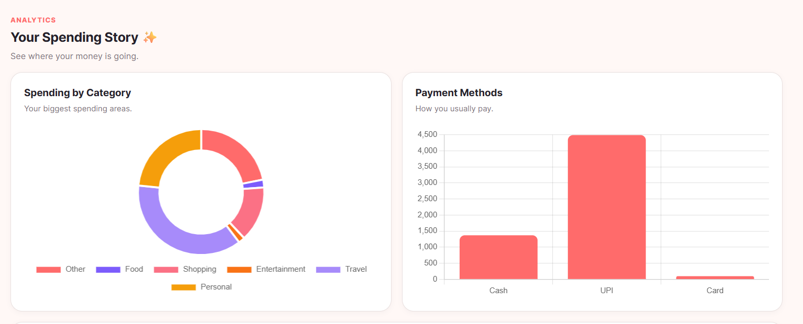

# 💸 Student Expense Tracker

A modern, student-focused expense management and analytics web application built with **Python, Flask, SQLite, HTML, CSS, JavaScript, and Chart.js**.

Track your expenses, analyze spending habits, filter transactions, export data, and personalize the dashboard with multiple themes.

## 🌐 Live Demo

**Live Application:**  
https://student-expense-tracker-c8bl.onrender.com

> Note: The current demo uses SQLite on an ephemeral deployment environment. Data should be treated as demo data and may not persist after service restarts or redeployments.

## ✨ Features

### Expense Management

- Add expenses
- View expenses
- Edit expenses
- Delete expenses
- Delete confirmation
- Input validation
- Future-date prevention

### Search & Filters

- Search by category or description
- Filter by category
- Filter by payment method
- Filter by date range
- Combine multiple filters

### Analytics Dashboard

- Total spending
- Number of transactions
- Average expense
- Highest expense
- Spending by category
- Spending by payment method
- Monthly spending trends
- Interactive Chart.js visualizations

### Export

- Export filtered expenses to CSV
- Export filtered expenses to Excel

### UI / UX

- Responsive dashboard
- Collapsible search/filter panel
- Four selectable color themes
- Theme persistence using localStorage
- Flash messages
- Custom 404 and 500 pages
- Mobile-friendly layout

## 🎨 Themes

Users can customize the dashboard with:

- 🪻 Lavender + Mint
- 🍑 Coral + Purple
- 🩵 Blue + Lilac
- 🍵 Sage + Cream

## 🛠 Tech Stack

| Technology | Purpose |
|---|---|
| Python 3.11 | Core programming language |
| Flask | Web framework |
| SQLite | Local relational database |
| HTML | Page structure |
| CSS | Styling and responsive UI |
| JavaScript | Frontend interactions |
| Chart.js | Data visualization |
| openpyxl | Excel export |
| Git | Version control |
| GitHub | Source code hosting |
| Render | Deployment |

## 📁 Project Structure

```text
Student-Expense-Tracker/
│
├── app/
│   ├── __init__.py
│   ├── constants.py
│   ├── db.py
│   ├── routes.py
│   ├── services.py
│   ├── validators.py
│   │
│   ├── templates/
│   │   ├── index.html
│   │   ├── add_expense.html
│   │   ├── edit_expense.html
│   │   ├── 404.html
│   │   └── 500.html
│   │
│   └── static/
│       └── style.css
│
├── data/
│
├── docs/
│   └── screenshots/
│       ├── dashboard.png
│       ├── theme-selector.png
│       ├── Expenses.png
│       └── analytics.png
│
├── .gitignore
├── .python-version
├── README.md
├── requirements.txt
└── run.py

## 📸 Screenshots

### Dashboard



### Theme Selector



### Add Expense



### Analytics



## 👩‍💻 Author

**Yashika Mule**

Computer Science Engineering (AI) Student

🔗 GitHub: https://github.com/yashi-dev21